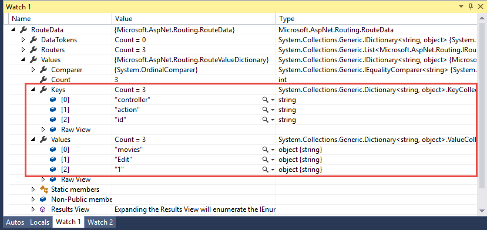
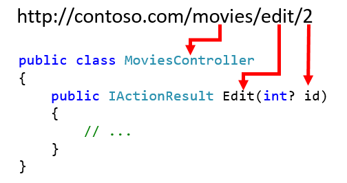
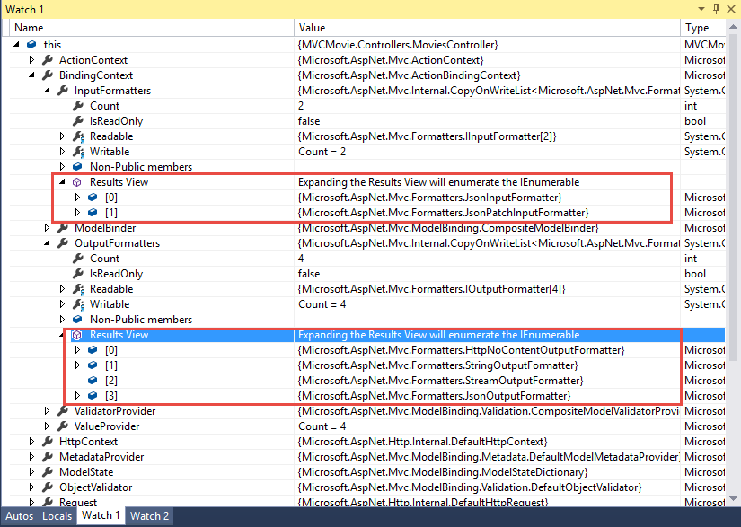

Model Binding
=============

By `Rachel Appel <http://github.com/rachelappel>`_

In this article

- `Introduction to model binding`_
- `How model binding works`_
- `Customize default model binding behavior with attributes`_
- `Binding formatted data from the request body`_ 
- `Resources`_

Introduction to model binding
-----------------------------
Model binders are objects in the ASP.NET MVC framework that map data from HTTP requests to action method parameters. The parameters may be simple types such as strings, integers, or floats, or they may be complex objects representing an enterprise-sized model. This is a great feature of MVC because mapping incoming data to a counterpart is an often repeated scenario, regardless of size or complexity of the data. MVC solves this problem by abstracting binding away so developers don't have to keep rewriting a slightly different version of that same code in every app. In previous versions of ASP, including Classic ASP and WebForms, you would extract the HTTP POST or GET values manually, validate the data, and then send that data off to the database. Not much of the process was automated, so you would often see code similar the following example that captures two form values, puts them in variables and TextBox objects, storing them for their journey to the database:

.. literalinclude:: model-binding/sample/src/MVCMovie/retro-sample.txt
   :language: html

The above code quickly becomes repetitive, cumbersome, and error prone to write, even when it's just a few fields. Real world apps often have many fields combined with complex structures. Admittedly, this kind of mapping code is a bit tedious to write as well. 

How model binding works
-----------------------
When ASP.NET MVC receives an incoming HTTP request, it routes it to a specific action method of a controller. It determines which action method to run based on what is in the route data, then it binds values from the HTTP request to that action method's parameters. For example, consider the following URL:

`http://contoso.com/movies/edit/2`

The default model binder compares the sections of the URL with the pattern defined in the ``RouteValues`` collection. Put a breakpoint in any action method to see the contents of the ``RouteData`` object at run time in a debug window, as illustrated here: 

Since the  routing pattern looks like this, ``{controller=Home}/{action=Index}/{id?}``, the route ``movies/edit/2`` maps to the ``Movies`` controller, and its ``Edit`` action method. It also accepts an optional ``id`` of 2 as the image shows here:

This is due to MVC's use of conventions. So the code for the action method should look something like this: 

.. literalinclude:: model-binding/sample/src/MVCMovie/Controllers/MoviesController.cs
   :language: c#
   :lines: 63-76  
   
.. note:: The strings in the URL are not case sensitive.

Routing knows which action method to use, so it checks for model binding attributes applied to the action method's arguments. If it finds a model binding attribute it will use the data source specified by the attribute. Otherwise, for each argument (a primitive type for now, more on complex types later), it looks in its data sources for something with a matching name. In the above example the only argument is an integer named `id`, so that is what the binder will look for. Below is a list of the data sources in the order that the model binder looks through them:
 
#. ``Request.Form``: These are form values that go in the HTTP request using the POST method.
#. ``RouteData.Values``: Contains information about each segment of the route. Route segments are separated by a forward slash ``/``.
#. ``Request.QueryStrings``: Data to the right of a question mark (?) in a URL, separated by ampersands (&). For example, genre and subgenre are query strings: http://contoso.com/movies?genre=Drama&subgenre=Crime

.. note:: Form, RouteData, and QueryStrings are all stored as name-value pairs.

In the example, the model binder is loos through the Request.Form first for a key named `id`. In this case it didn't find anything, so it moved on to RouteData.Values looking for a key with a name of `id`. In our example, it's a match, since the last portion of the route has a key value of `id`, and it is an integer. Binding happens, and the value of the id parameter becomes 2. If the action method's parameter were a complex type such as the ``Movie`` type, which likely contains both primitive and complex types, MVC's model binder will still handle it nicely. It uses reflection and recursion to traverse the properties of complex types through its tree, and comparing any primitive members' names against the names of keys in data sources. The model binder can bind objects that contain nested objects for multiple levels. 

.. note:: When the binder finds the first matching name in the data source, it stops looking for more elements matching that name, and moves onto the next property or item in the parameter list. 
 
.. note:: If for some reason binding can't happen, it quietly fails.
 
Additionally, there are some special data types that ASP.NET MVC must consider when performing model binding:

- ``Request.Files``: Uploaded files that are part of the HTTP request.
- ``IFormCollection``: The collection of key-value pairs that represent the form data.
- Cancelation token: Used to cancel activity in asynchronous controllers.

Once model binding is complete, validation occurs. The default model binders are quite smart, and work great for the vast majority of development scenarios. ASP.NET MVC is extensible so if you have unique needs you can customize the built in model binders.  

Customize default model binding behavior with attributes 
--------------------------------------------------------
ASP.NET MVC contains several attributes that you can use to direct its default model binding behavior to a different source. For example, you can specify whether binding is required for a field, or if it should never happen at all by using the ``[BindRequired]`` or ``[BindNever]`` attributes. Alternatively, you can override the default value, and specify the model binder's data source, which is what the ``[From*]`` attributes do, such as the ``[FromForm]`` or ``[FromQuery]``. While the topic of model binding extensibility in depth is outside of the scope of this doc, here are a few customizations that you should be aware of:

- ``[BindRequired]``: This attribute forces a Model state error if binding cannot occur.
- ``[BindNever]``: Tells the model binder to never bind to this parameter.
- ``[FromHeader]``, ``[FromQuery]``, ``[FromRoute]``, ``[FromForm]``: Use these to specify the exact binding source you want to apply.
- ``[FromServices]``: Only supported on action parameters. 
- ``[FromBody]``: Instructs the model binder to use the JSON media type formatter rather than regular model binding.
- ``[ModelBinder]``: You reject the current model binder and substitute it with your own.

A good example of binding attribute usage in the wild is when you see the ``[FromBody]`` attribute in action methods of API Controllers. While there are only a few differences between standard MVC and API Controllers, one such difference is that API Controllers attempt to retrieve data from the request URI in PUT and POST messages, rather than from the body by default. This means that when a page sends data via an Ajax call, Web API actions still look in the header, but applying the ``[FromBody]`` attribute will direct the model binder to the correct data source, as shown in the snippet below:

.. literalinclude:: model-binding/sample/src/MVCMovie/Controllers/MoviesAPIController.cs
   :language: c#
   :lines: 47-49

Binding attributes are very helpful tools when you need to nudge the default behaviors of model binders.

Binding formatted data from the request body
--------------------------------------------
Formatting data is an important behavior of controllers, and it influences model binding behavior as well. A formatter is an object that accepts data and serializes or deserializes it into some shape. JSON is the most popular format, as it's the smallest and most lightweight way to structure textual data. It's also the default format for API controllers. Below is a list of several built-in formatters:  

Input formatters:

- ``JsonInputFormatter``: Based on JSON.NET, this object deserializes the requested resource from JSON into an object. 
- ``JsonPatchInputFormatter``: Assists the JsonInputFormatter.

Output formatters:

- ``JsonOutputFormatter``: This is the counterpart to the JsonInputFormatter which serializes objects to JSON. 
- ``HttpNoContentOutputFormatter``: This formatter handles responses with an HTTP status code 204, no content. 
- ``StringOutputFormatter``: This formatter handles basic string responses.
- ``StreamOutputFormatter``: This formatter handles outgoing streams.

ASP.NET selects input formatters based on the Content-Type header and the type of the parameter, unless there is an attribute specifying otherwise. If you'd like to use XML or another format you must configure it in the Startup.cs file. You may have to install a NuGet package for the formatter you want. To see the formatters at runtime, set a breakpoint at the beginning of an action method and investigate the controller's ``ModelBindingContext`` object when in debug mode. You can find ``this``, which refers to the controller, in a debug window, as shown here:

Resources
---------
Below are links to the source code for model binding and formatters in ASP.NET MVC:

- `Model binding source code <https://github.com/aspnet/Mvc/tree/dev/src/Microsoft.AspNet.Mvc.Core/ModelBinding>`_
- `Formatters source code <https://github.com/aspnet/Mvc/tree/dev/src/Microsoft.AspNetCore.Mvc.Core/Formatters>`_
- `Json Formatter source code <https://github.com/aspnet/Mvc/tree/dev/src/Microsoft.AspNetCore.Mvc.Formatters.Json>`_
- `Xml Formatter source code <https://github.com/aspnet/Mvc/tree/dev/src/Microsoft.AspNetCore.Mvc.Formatters.Xml>`_